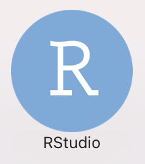
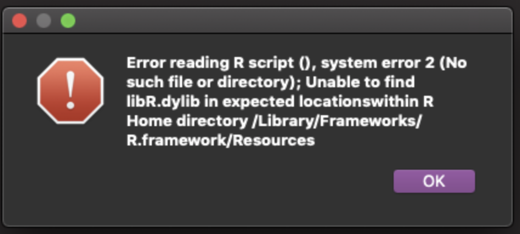
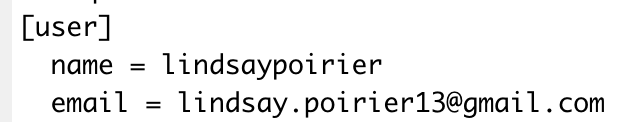
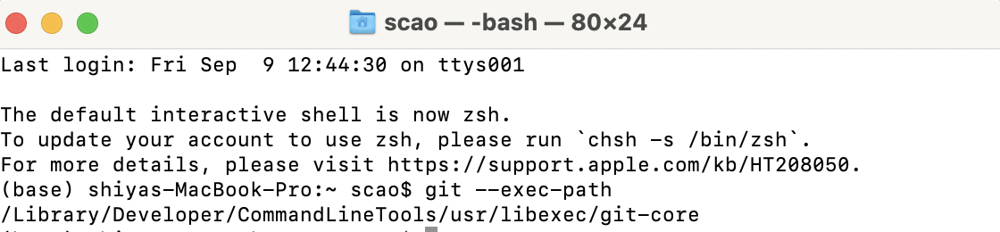
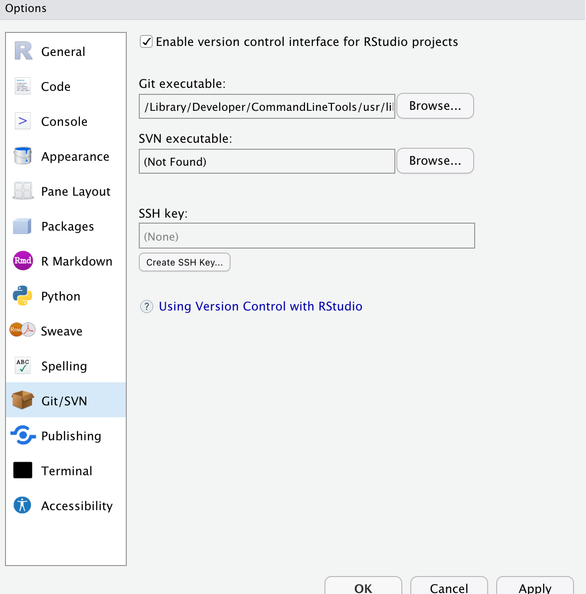
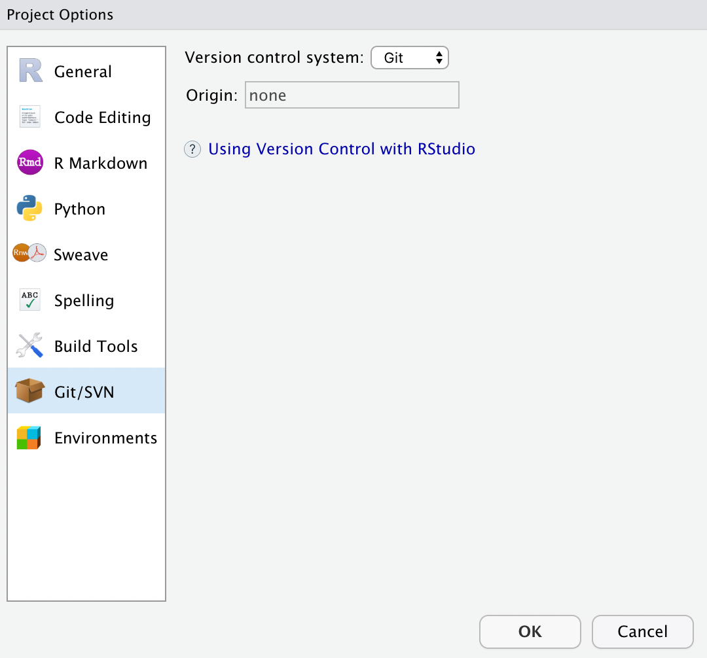

# Lab 1: GitHub

*Due Wednesday 2/8 at 9pm.*

## Why do we use GitHub in this course?

* Make research reproducible.
* Collaboration with version control.
* Integrated with RStudio.

## Suggestions for today's lab

Getting a coding environment set up is arguably the most challenging part of a project. We **are** going to run into frustrations today. That's part of the process, but learning to get past those hurdles is the key to really getting comfortable with GitHub. I'm going to do whatever I can to support you through them, which is why I'm carving out class time to do it. I don't expect every issue we run into to be sorted out by the end of class. I'm telling you this because I don't want you to worry if you run into roadblocks in setting up in your environment. **We will get through them.**

On the other hand, some of you might breeze through this, having certain components already set up or having previous experience configuring GitHub. While not required, if you finish early and would be willing to help me troubleshoot other issues that come up, it would certainly be appreciated. 

## Getting started

Below are instructions for setting up our course environment. It's important that you follow them in order and do exactly as is described in the videos. If you have any questions, reach out to me. 

**Don't worry if you don't know what certain terms mean at this point. We'll be going over things like what it means to commit code a little later in the semester.** I just believe it'll be easier to follow along with me in learning those things if you can follow along on your own computers. That's why we're taking this step to get things up and running so early in the semester. 

1. Follow the instructions in [chapter 4](https://happygitwithr.com/github-acct.html) of *Happy Git and GitHub for the useR* to create a GitHub account. If you already have a GitHub account, skip this step. 

2. I believe you've already installed R and RStudio because you are taking SDS 100 or have taken other SDS courses. But if not, follow [these instructions](https://rstudio-education.github.io/hopr/starting.html) to download and install R and RStudio. Be sure to install R first and RStudio second. 

3. Open RStudio.

**CONGRATULATIONS! You've installed all of the software needed for this course. Now onto configuration.** 

4. Follow instructions in this video to ensure git is installed: 

<p><a href="https://vimeo.com/511798611">Verify Git Installation</a> from <a href="https://vimeo.com/user95475944">David Keyes</a> on <a href="https://vimeo.com">Vimeo</a>.</p>

4.1 If git is installed, go to Step 5.

4.2 If git is not installed, follow the instructions in [chapter 6](https://happygitwithr.com/install-git.html) of *Happy Git and GitHub for the useR* to install git.

**Espeically, if you use Windows**, please first go [here](https://gitforwindows.org/) to download Git. Then install Git by launching the installer after it downloads. You can accept all the defaults during installation. Next, in RStudio, click Tools > Global Options > Terminal, RStudio should automatically detect the presence of Git Bash; you want to see "Git Bash" in the "New terminals open with ..." dropdown menu. Then click Apply. It will ask you to restart RStudio, click Yes. Then in RStudio, click the "Terminal" tab, create a new terminal. Then you should access Git Bash in RStudio. Then go back to Step 4 to ensure git is installed.

5. In the last step you clicked the 'Terminal' tab at the bottom of your screen. Go to that same section of your screen and click the 'Console' tab.

6. Follow the instruction 6.1 or the instruction 6.2 to configure git: 

6.1 If you are configuring git for the first time (most of you will be), copy and paste the following into your console:

```
install.packages("usethis")
library(usethis)
```
After you've entered this, you should copy and paste the following into your console, replacing USERNAMEHERE with your GitHub username and EMAILHERE with your GitHub email:

```
use_git_config(user.name = "USERNAMEHERE", user.email = "EMAILHERE")
```

6.2 If you've configured git on your computer before, you can edit your git config by following these instructions: 

<p><a href="https://vimeo.com/511798861">Edit gitconfig file</a> from <a href="https://vimeo.com/user95475944">David Keyes</a> on <a href="https://vimeo.com">Vimeo</a>.</p>

7. Create a personal access token in GitHub by following these instructions. **Set the expiration date to 120 days from now**: 

<p><a href="https://vimeo.com/511801645">Create a Personal Access Token (PAT) on GitHub</a> from <a href="https://vimeo.com/user95475944">David Keyes</a> on <a href="https://vimeo.com">Vimeo</a>.</p>

8. Store your personal access token by following these instructions: 

<p><a href="https://vimeo.com/511803103">Store Personal Access Token to Connect RStudio and GitHub</a> from <a href="https://vimeo.com/user95475944">David Keyes</a> on <a href="https://vimeo.com">Vimeo</a>.</p>

**CONGRATULATIONS! You've configured GitHub to connect with RStudio! Now onto assignment submission practice.** 

9. Click <a href="https://classroom.github.com/a/9jhk7oQu">this link</a> to accept this assignment in our GitHub classroom. Then a private repository (repo) will be automatically created for you. It might take a few minutes. 

10. Once the repo is created, copy and paste the "Clone" URL from the repo that was just created to your clipboard. It should look something like https://github.com/sds192spring2023/lab1-yourusername.git

11. Create a project in RStudio from the GitHub repo that was just created by following the instructions starting at 26 seconds of this video:

<p><a href="https://vimeo.com/511804881">How to Connect RStudio Projects with GitHub Repositories: GitHub First</a> from <a href="https://vimeo.com/user95475944">David Keyes</a> on <a href="https://vimeo.com">Vimeo</a>.</p>

12. Open the Lab1.qmd file from the Files tab in RStudio. Follow the instruction in the file. 

13. When the file instruction tells you to commit your code, follow the instructions in this video starting at 14 seconds: 

<p><a href="https://vimeo.com/511800674">Make a Commit and View More History</a> from <a href="https://vimeo.com/user95475944">David Keyes</a> on <a href="https://vimeo.com">Vimeo</a>.</p>

14. Push your code to GitHub by following the instructions in this video starting at 27 seconds:

<p><a href="https://vimeo.com/511805399">General Workflow: Push</a> from <a href="https://vimeo.com/user95475944">David Keyes</a> on <a href="https://vimeo.com">Vimeo</a>.</p>

**CONGRATULATIONS! You've completed our course infrastructure set-up!** 

15. Fill out this week's reflections [Google Form](https://docs.google.com/forms/d/e/1FAIpQLSe7sTBJ020sZbb4uNZ2avVAgLxHq68T5RhdKiydy5LaFxHHsg/viewform?usp=sf_link).

## Assessment

You will be evaluated on the completion of your lab.

In this assignment, the following standards will be assessed (the number in () indicates the maximum points you can earn for a paticulrar standard for this lab): 

GITHUB (0.25)

---
## Troubleshooting Common Issues

Here I will list common issues that folks faced at different steps of getting our course infrastructure set-up and how they fixed them:

### Every time I try to open RStudio, I'm being prompted to reinstall RStudio.

This was happening for a few students on Windows machines. The reason is that you are clicking the file to install/RStudio, rather than the file to open the application. See if you can find the icon for RStudio when you open C:/ProgramFiles. The icon should look like this:



### I'm seeing this image when I try to open RStudio:



This means that you likely installed RStudio but not R. Check back in on the instructions in Step 2 to make sure that you install R **and** RStudio. 

### When I try to open RStudio, I’m not seeing the screen that appears in David Keyes's video in step 4. 

You are probably trying to open R rather than RStudio. Make sure you click on this icon:


…and not this one:


### When I type in `which git`, I'm getting an error message that says that 'which' is not recognized. 

David Keyes was recording this video on a Mac. If which is not recognized, it's likely because you are on a Windows machine. Try typing `where git` instead of `which git`. 

### I don’t have git installed. 

You should follow the steps here to install git: https://happygitwithr.com/install-git.html
Be sure to follow the instructions for your specific operating system. After you're done you can confirm that it’s installed by typing:

`where git` into the Terminal if you are on Windows
`which git` into the Terminal if you are on MacOS

### I’m getting an error message when trying to install the "usethis" package. 

Try copying and pasting the `install.packages("usethis")` code into your console first and click enter. You will be asked "Do you want to install from sources the packages which need compilation? (Yes/no/cancel)", and you can type 'yes'. After that, a bunch of lines of code will run with red font. Once this is done, copy and paste the `library(usethis)` line into your Console and click enter. 

### I’m getting an error message that rlang is not installed. 

In your console type `install.packages("rlang")`. Then re-try Step 7. 

### I'm getting the following error when I try to set my git credentials:

```
Error in new_git_error("git_error", args = args, stdout = out, status = attr(out,  :
  System git failed: xcrun: error: invalid active developer path (/Library/Developer/CommandLineTools), missing xcrun at: /Library/Developer/CommandLineTools/usr/bin/xcrun
```
  
Switch to the Terminal tab in the bottom left hand corner of RStudio and enter the following:

`xcode-select --install`

Then try again. 

### I'm getting an error message that RStudio can't find Git.

Following the instructions at this link: https://happygitwithr.com/rstudio-see-git to tell RStudio where to find git. 

### I'm getting the following error:

```
Error in new_git_error("git_error", args = args, stdout = out, status = attr(out,  :
  System git failed: fatal: bad config line ...
```

This means that you probably added some unrecognized characters in your git config file. 
Enter:

```
library(usethis)
edit_git_config
```

This will open your config file. Check to make sure you don't have extra quotation marks in your user name or email address. It should look something like this. 



### When I try to create a new project, I'm getting the error:

```
remote: Support for password authentication was removed on August 13, 2021. Please use a personal access token instead.
```

This means that you likely set up some git credentials on your computer in the past. GitHub used to identify you by a password, but now they use the special token you generated in an earlier step. To fix this, you can enter the following into your console:

```
install.packages("gitcreds")
library(gitcreds)
gitcreds_set()
```
You'll see the following message:

```
1: Keep these credentials
2: Replace these credentials
3: See the password / token
```

Click 2. Then enter the personal access token you created in step 9. You should be able to create a project after this. 

### When I try to create a new project via File>New Project>Version Control>Git, I'm getting the error: Git was not detected on the system path.

This means that the git path (/usr/bin/git) set under global options was not valid. To fix this, please follow these steps:

(1) Enter git --exec-path in your computer terminal window as the screenshot below shows. It will give you a path (mine is /Library/Developer/CommandLineTools/usr/libexec/git-core; yours may be different). 



(2) Then in RStudio, click Tools>Global Options>Git/SVN, in the section of Git executable, Browse in your computer to find the path: /Library/Developer/CommandLineTools/usr/libexec/git-core/git Then click Apply. Then you can cancel this window.



(3) The next step is in RStudio, click Tools>Project Options>Git/SVN, select Git for Version control system as the screenshot below shows. This step needs to be done in a project environment; otherwise it won't show you Project Options.


